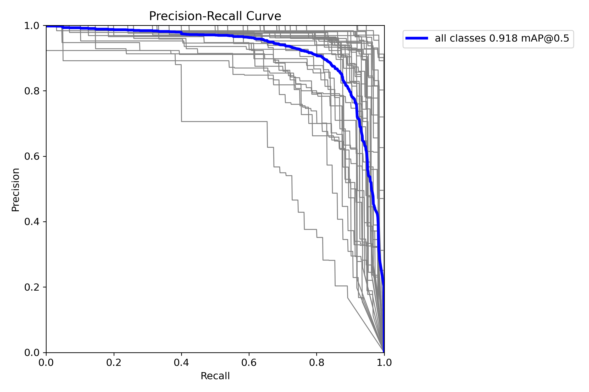

Training and Results
---

The model was trained with the following parameters:
```yaml
    epochs: 512
    batch: 64
    imgsz: 320
    iou: 0.7
    max_det: 300
    lr0: 0.01
    lrf: 0.01
    momentum: 0.937
    weight_decay: 0.0005
    warmup_epochs: 3.0
    warmup_momentum: 0.8
    warmup_bias_lr: 0.1
```

## Dataset
1. **Label distribution for training:**
   
2. **Train bach example:**
   
3. **Train bach example:**
   

## Experiments

1. **Loss curve**
    

2. **Confusion Matrix**


3. **F1, Precision and Recall**




# Results Table
| Class                      	| Instances 	| Box [P] 	 | Box [R]     	 | Box [mAP50] 	 | Box [mAP50-95] 	 | Mask [P] 	 | Mask [R]     	 | Mask [mAP50] 	 | Mask [mAP50-95] 	 |
|----------------------------	|-----------	|-----------|---------------|---------------|------------------|------------|----------------|----------------|-------------------|
| all                        	| 2201      	| 0.899 	   | 0.863 	       | 0.918 	       | 0.856     	      | 0.899  	   | 0.863 	        | 0.918 	        | 0.81      	       |
| Abyssinian                 	| 58        	| 0.96  	   | 0.831 	       | 0.942 	       | 0.872     	      | 0.96   	   | 0.831 	        | 0.942 	        | 0.814     	       |
| Bengal                     	| 61        	| 0.878 	   | 0.71  	       | 0.898 	       | 0.859     	      | 0.878  	   | 0.71  	        | 0.898 	        | 0.789     	       |
| Birman                     	| 61        	| 0.742 	   | 0.918 	       | 0.838 	       | 0.729     	      | 0.742  	   | 0.918 	        | 0.838 	        | 0.726     	       |
| Bombay                     	| 66        	| 0.969 	   | 0.963 	       | 0.977 	       | 0.928     	      | 0.969  	   | 0.963 	        | 0.977 	        | 0.884     	       |
| British_Shorthair          	| 62        	| 0.939 	   | 0.919 	       | 0.98  	       | 0.957     	      | 0.939  	   | 0.919 	        | 0.98  	        | 0.904     	       |
| Egyptian_Mau               	| 48        	| 0.802 	   | 0.846 	       | 0.918 	       | 0.879     	      | 0.802  	   | 0.846 	        | 0.918 	        | 0.817     	       |
| Maine_Coon                 	| 55        	| 0.907 	   | 0.889 	       | 0.917 	       | 0.855     	      | 0.907  	   | 0.889 	        | 0.917 	        | 0.836     	       |
| Persian                    	| 58        	| 0.956 	   | 0.948 	       | 0.971 	       | 0.92      	      | 0.956  	   | 0.948 	        | 0.971 	        | 0.896     	       |
| Ragdoll                    	| 57        	| 0.894 	   | 0.744 	       | 0.865 	       | 0.802     	      | 0.894  	   | 0.744 	        | 0.865 	        | 0.727     	       |
| Russian_Blue               	| 52        	| 0.926 	   | 0.956 	       | 0.978 	       | 0.917     	      | 0.926  	   | 0.956 	        | 0.978 	        | 0.883     	       |
| Siamese                    	| 62        	| 0.946 	   | 0.84  	       | 0.92  	       | 0.859     	      | 0.927  	   | 0.824 	        | 0.902 	        | 0.783     	       |
| Sphynx                     	| 73        	| 0.914 	   | 0.918 	       | 0.937 	       | 0.859     	      | 0.928  	   | 0.932 	        | 0.951 	        | 0.828     	       |
| american_bulldog           	| 61        	| 0.795 	   | 0.754 	       | 0.799 	       | 0.731     	      | 0.795  	   | 0.754 	        | 0.799 	        | 0.679     	       |
| american_pit_bull_terrier  	| 55        	| 0.693 	   | 0.616 	       | 0.662 	       | 0.599     	      | 0.693  	   | 0.616 	        | 0.662 	        | 0.592     	       |
| basset_hound               	| 59        	| 0.921 	   | 0.932 	       | 0.95  	       | 0.905     	      | 0.921  	   | 0.932 	        | 0.95  	        | 0.836     	       |
| beagle                     	| 60        	| 0.847 	   | 0.717 	       | 0.84  	       | 0.756     	      | 0.866  	   | 0.733 	        | 0.859 	        | 0.738     	       |
| boxer                      	| 56        	| 0.821 	   | 0.786 	       | 0.851 	       | 0.82      	      | 0.821  	   | 0.786 	        | 0.851 	        | 0.75      	       |
| chihuahua                  	| 65        	| 0.884 	   | 0.706 	       | 0.8   	       | 0.749     	      | 0.884  	   | 0.706 	        | 0.8   	        | 0.662     	       |
| english_cocker_spaniel     	| 73        	| 0.963 	   | 0.704 	       | 0.926 	       | 0.842     	      | 0.963  	   | 0.704 	        | 0.926 	        | 0.826     	       |
| english_setter             	| 54        	| 0.87  	   | 0.963 	       | 0.973 	       | 0.898     	      | 0.87   	   | 0.963 	        | 0.973 	        | 0.85      	       |
| german_shorthaired         	| 68        	| 0.927 	   | 0.897 	       | 0.932 	       | 0.815     	      | 0.927  	   | 0.897 	        | 0.932 	        | 0.781     	       |
| great_pyrenees             	| 57        	| 1     	   | 0.895 	       | 0.981 	       | 0.91      	      | 1      	   | 0.895 	        | 0.981 	        | 0.874     	       |
| havanese                   	| 49        	| 0.888 	   | 0.878 	       | 0.861 	       | 0.792     	      | 0.888  	   | 0.878 	        | 0.861 	        | 0.761     	       |
| japanese_chin              	| 54        	| 0.883 	   | 0.963 	       | 0.976 	       | 0.87      	      | 0.866  	   | 0.944 	        | 0.947 	        | 0.801     	       |
| keeshond                   	| 67        	| 0.954 	   | 0.933 	       | 0.971 	       | 0.922     	      | 0.954  	   | 0.933 	        | 0.971 	        | 0.88      	       |
| leonberger                 	| 58        	| 0.91  	   | 0.872 	       | 0.966 	       | 0.922     	      | 0.91   	   | 0.872 	        | 0.966 	        | 0.848     	       |
| miniature_pinscher         	| 50        	| 0.83  	   | 0.84  	       | 0.893 	       | 0.837     	      | 0.83   	   | 0.84  	        | 0.893 	        | 0.77      	       |
| newfoundland               	| 65        	| 0.922 	   | 0.938 	       | 0.98  	       | 0.938     	      | 0.922  	   | 0.938 	        | 0.98  	        | 0.893     	       |
| pomeranian                 	| 52        	| 0.92  	   | 0.885 	       | 0.945 	       | 0.874     	      | 0.92   	   | 0.885 	        | 0.945 	        | 0.818     	       |
| pug                        	| 62        	| 0.931 	   | 0.903 	       | 0.902 	       | 0.878     	      | 0.931  	   | 0.903 	        | 0.902 	        | 0.817     	       |
| saint_bernard              	| 61        	| 0.926 	   | 0.902 	       | 0.963 	       | 0.891     	      | 0.926  	   | 0.902 	        | 0.963 	        | 0.873     	       |
| samoyed                    	| 64        	| 0.951 	   | 0.984 	       | 0.992 	       | 0.938     	      | 0.951  	   | 0.984 	        | 0.992 	        | 0.896     	       |
| scottish_terrier           	| 55        	| 0.91  	   | 0.982 	       | 0.982 	       | 0.918     	      | 0.91   	   | 0.982 	        | 0.982 	        | 0.883     	       |
| shiba_inu                  	| 60        	| 0.953 	   | 0.933 	       | 0.947 	       | 0.901     	      | 0.953  	   | 0.933 	        | 0.947 	        | 0.855     	       |
| staffordshire_bull_terrier 	| 58        	| 0.844 	   | 0.655 	       | 0.823 	       | 0.754     	      | 0.844  	   | 0.655 	        | 0.823 	        | 0.719     	       |
| wheaten_terrier            	| 62        	| 0.94  	   | 0.952 	       | 0.966 	       | 0.9       	      | 0.94   	   | 0.952 	        | 0.966 	        | 0.859     	       |
| yorkshire_terrier          	| 63        	| 0.949 	   | 0.857 	       | 0.94  	       | 0.861     	      | 0.949  	   | 0.857 	        | 0.94  	        | 0.806     	       |
